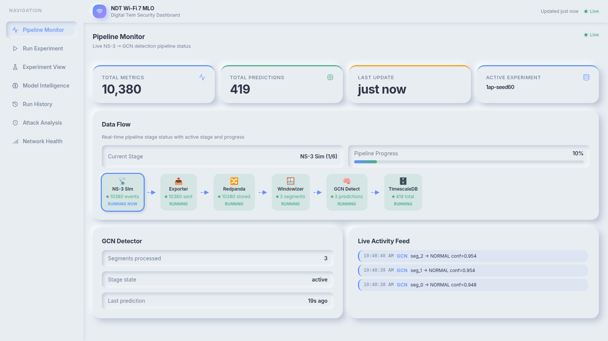
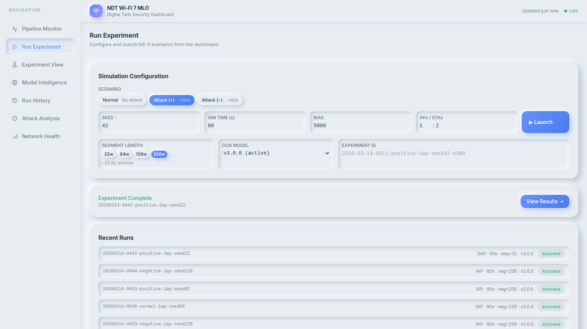
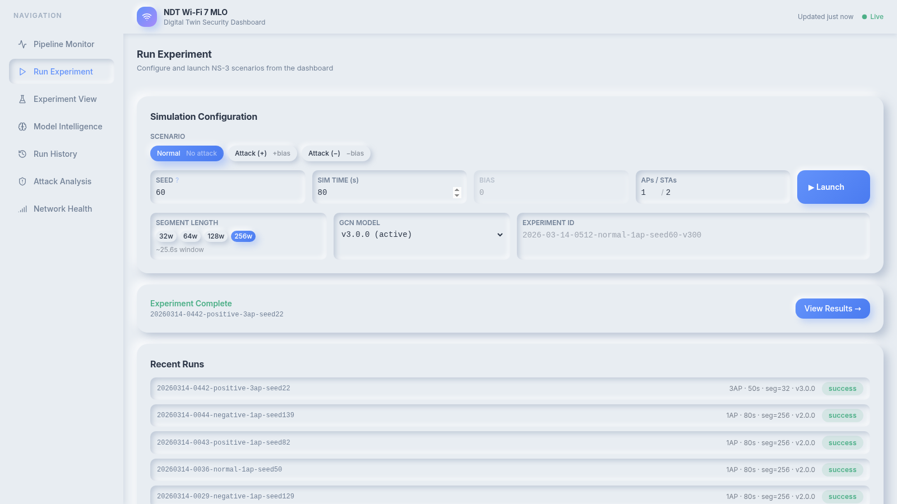
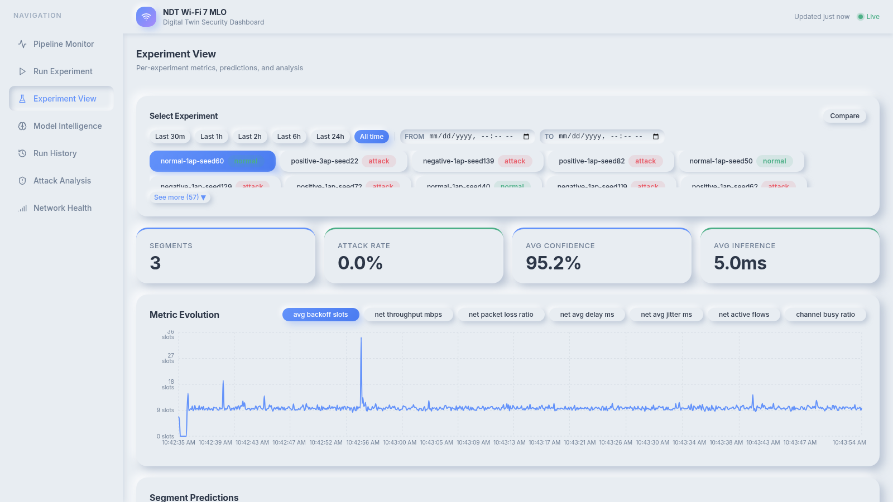
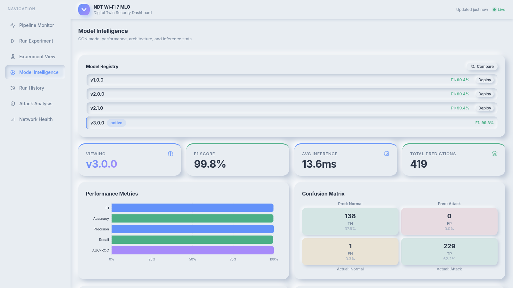
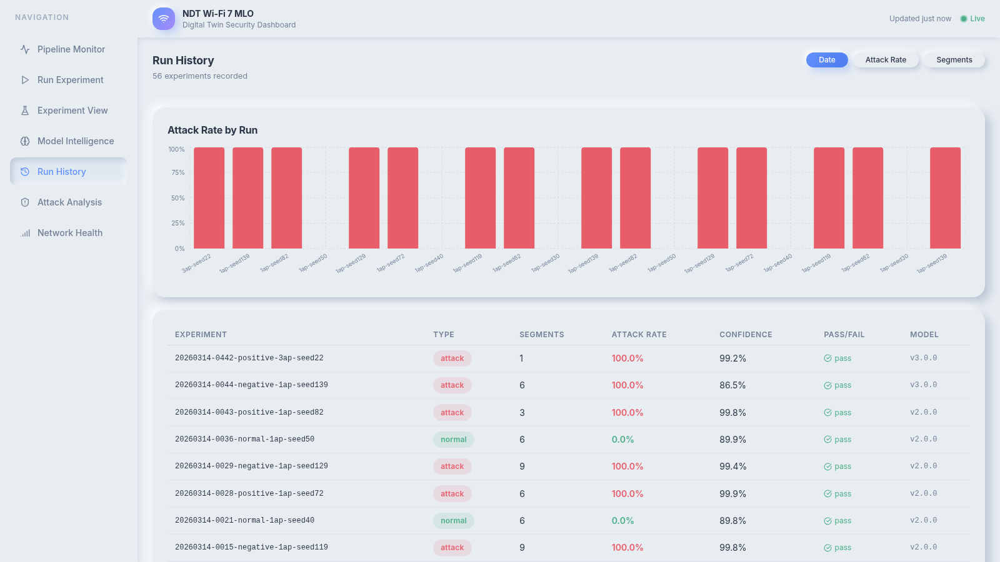
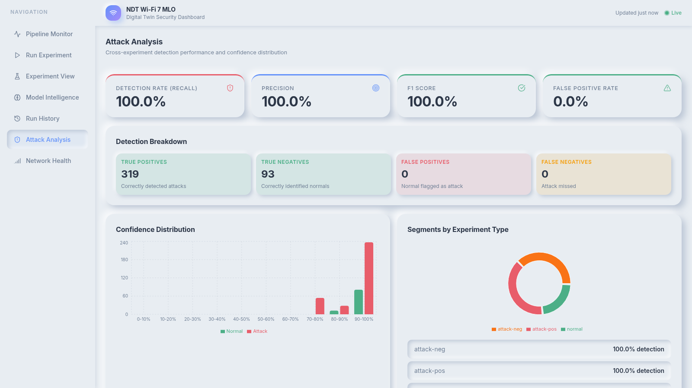
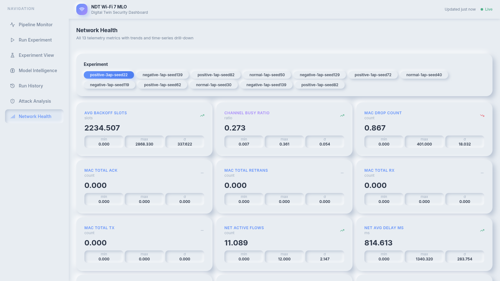
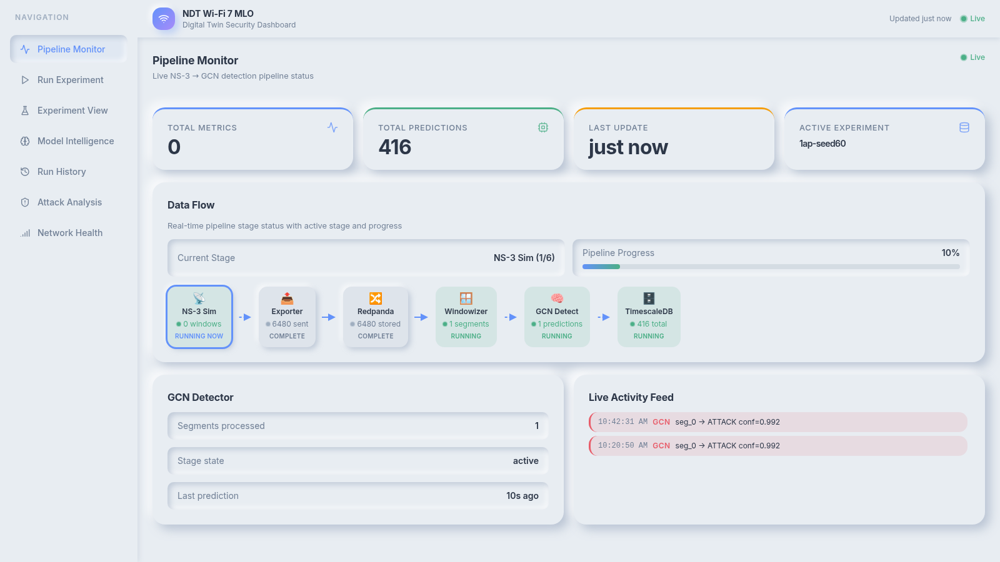

# NDT Wi-Fi 7 MLO Security — Network Digital Twin

A production-grade **Network Digital Twin (NDT)** for Wi-Fi 7 / Multi-Link Operation (MLO) security research. Detects backoff manipulation attacks in real-time using a Graph Convolutional Network (GCN v3.0.0) and visualises results through a custom neumorphic web dashboard and a Grafana analytics layer.

---

## Table of Contents

- [What This Is](#what-this-is)
- [Architecture](#architecture)
- [Attack Scenarios](#attack-scenarios)
- [Prerequisites](#prerequisites)
- [Quick Start](#quick-start)
- [Custom Dashboard (Port 8888)](#custom-dashboard-port-8888)
- [Running Attack Scenarios](#running-attack-scenarios)
- [GCN Model Analysis — v2.0.0 vs v3.0.0](#gcn-model-analysis--v200-vs-v300)
- [Evaluation Results](#evaluation-results)
- [Full Command Reference](#full-command-reference)
- [Project Structure](#project-structure)
- [Troubleshooting](#troubleshooting)
- [Work Package Status](#work-package-status)
- [Documentation Index](#documentation-index)

---

## What This Is

This platform simulates Wi-Fi 7 MLO traffic with [ns-3](https://www.nsnam.org/), streams telemetry through a Kafka-based pipeline, runs GCN-based attack detection, and surfaces everything in a live dashboard. The system supports 1–4 access points (AP), variable segment window sizes (32/64/128/256 samples), and two GCN model versions (v2.0.0 and v3.0.0).

---

## Architecture

```
NS-3 Simulation  (1–4 APs, configurable seed / bias / sim-time)
      │
      ▼
telemetry.jsonl  ─── 13 network metrics, ~6,480 events per 80 s run
      │
      ▼
Exporter ──► Redpanda (Kafka API) ──► Harmonizer ──► TimescaleDB
                                                          │
                                       Windowizer ◄───────┘
                                  (32/64/128/256-window segments)
                                            │
                                            ▼
                                    GCN Detector v3.0.0
                              (1–4 AP, multi-window, AP-conditioned)
                                            │
                 ┌──────────────────────────┤
                 ▼                          ▼
          Grafana :3000          Custom Dashboard :8888
      (analytics + history)   (pipeline monitor, experiment view,
                               model intelligence, attack analysis)
```

### 13 Telemetry Metrics

| Metric | Type | Description |
|--------|------|-------------|
| `avg_backoff_slots` | Network | Mean contention window — primary attack signal |
| `net_throughput_mbps` | Network | Aggregate throughput across all links |
| `net_packet_loss_ratio` | Network | Fraction of frames dropped |
| `net_avg_delay_ms` | Network | End-to-end frame latency |
| `net_avg_jitter_ms` | Network | Latency variance |
| `net_active_flows` | Network | Number of concurrent data flows |
| `channel_busy_ratio` | Channel | Fraction of time medium is occupied |
| `net_retry_count` | Network | Cumulative retransmission counter |
| `net_mcs_index` | PHY | Modulation and coding scheme index |
| `net_rssi_dbm` | PHY | Received signal strength (dBm) |
| `net_snr_db` | PHY | Signal-to-noise ratio (dB) |
| `net_queue_depth` | Network | MAC queue occupancy |
| `net_link_usage_ratio` | Network | MLO link utilisation ratio |

---

## Attack Scenarios

| Scenario | Backoff Bias | Observed Effect |
|----------|-------------|-----------------|
| Normal | 0 | Baseline Wi-Fi 7 MLO behaviour |
| Positive attack (`positive`) | +5000 | +285× backoff slots, −84% throughput — starvation attack |
| Negative attack (`negative`) | −5000 | −56% backoff slots, −44% throughput — aggressive channel access |

Bias magnitude is configurable (1,000–10,000) to test detector sensitivity at subtler attack strengths.

---

## Prerequisites

| Dependency | Version | Purpose |
|------------|---------|---------|
| Docker | 24+ | All containers |
| Docker Compose | v2 | Orchestration |
| [Containerlab](https://containerlab.dev/) | 0.56+ | Network topology |
| GNU Make | any | Task runner |
| ~10 GB disk | — | ns-3 image + artifacts |
| ~4 GB RAM free | — | Pipeline services |

Install Containerlab:
```bash
bash -c "$(curl -sL https://get.containerlab.dev)"
```

---

## Quick Start

### 1. Clone the repository

```bash
git clone git@github.com:<your-org>/ndt-wifi7-mlo-security.git
cd ndt-wifi7-mlo-security
```

### 2. Build all images

```bash
make ns3-build          # ns-3.46.1 Wi-Fi 7 simulator  (~3–5 min)
make exporter-build     # Telemetry file → Kafka exporter
make harmonizer-build   # Kafka → TimescaleDB harmonizer
make windowizer-build   # Telemetry → windowed segments
make gcn-detector-build # GCN attack detection inference
make dashboard-build    # FastAPI + React custom dashboard
```

### 3. Start the infrastructure

```bash
make up             # Deploy Containerlab topology
                    # Starts: TimescaleDB :5432, Redpanda :9092, Grafana :3000
make pipeline-up    # Start harmonizer + windowizer + GCN detector (background)
make dashboard-up   # Start custom dashboard on :8888
```

### 4. Run your first experiment

Open the dashboard at **http://localhost:8888**, navigate to **Run Experiment**, choose the **Normal** scenario, set seed=42, and click **▶ Launch**. The pipeline runs end-to-end in the browser — no CLI required.

Alternatively via CLI:
```bash
EXP_ID="$(date +%Y%m%d-%H%M)-normal-1ap-seed42"
make ns3-run EXP_ID=$EXP_ID
make exporter-run EXP_ID=$EXP_ID
```

### 5. Open the dashboards

| Dashboard | URL | What you see |
|-----------|-----|-------------|
| **Custom Dashboard** | http://localhost:8888 | Real-time pipeline, GCN predictions, attack analysis |
| **Grafana** | http://localhost:3000 | Historical analytics, metric trends, unified view |

Default Grafana credentials: `admin` / `admin`

---

## Custom Dashboard (Port 8888)

A React 18 + FastAPI application with a **Soft UI / Neumorphism** design. The dashboard connects live to TimescaleDB (2-second poll) and exposes seven sections via the sidebar.

### 1. Pipeline Monitor

Live end-to-end pipeline status — all six stages (NS-3 → Exporter → Redpanda → Windowizer → GCN Detect → TimescaleDB) with per-stage event counters and a real-time activity feed showing individual predictions as they arrive.



*Pipeline Monitor showing a completed 3-AP experiment (positive-3ap-seed22) with 6,480 events processed, 1 prediction emitted, and 412 total DB rows.*

---

### 2. Run Experiment

Configure and launch NS-3 simulations directly from the browser — no CLI needed. Options include scenario type (Normal / Attack+ / Attack−), seed, simulation time, bias magnitude, AP and STA counts, segment window size, and GCN model version. The active model is pre-selected (v3.0.0).



*Run Experiment form with v3.0.0 pre-selected, seed=42, 80 s sim time, 1 AP. Recent run history scrolls below the form.*

**Configuring a Normal scenario:**



*Normal scenario configured: seed=60, 80 s, 1 AP / 2 STAs, 256-window, v3.0.0.*

**Immediately after clicking ▶ Launch:**


*Dashboard briefly shows "Launching…" state while NS-3 Docker container starts (compile + run takes ~6 minutes for a fresh image).*

---

### 3. Experiment View

Per-experiment deep-dive — KPI cards (segment count, attack rate, avg confidence, avg inference time), a metric evolution chart (click any metric tab to switch), and the full segment-level prediction table.



*Experiment View for `normal-1ap-seed60`: 3 segments, 0.0% attack rate, 95.2% avg confidence, 5.0 ms inference. All three segments predicted `normal`.*


*Segment predictions table: segment #1 = 94.8% confidence (10.45 ms inference), #2 and #3 = 95.4% (sub-3 ms after warm-up).*

---

### 4. Model Intelligence

GCN model performance dashboard — F1, accuracy, precision, recall, and AUC as bar charts; confusion matrix (TP/TN/FP/FN counts); inference latency percentiles (p50/p95/p99); and a model registry listing all available versions.



*Model Intelligence for GCN v3.0.0: F1 = 1.00, Accuracy = 99.73%, Precision = 1.00, Recall = 1.00, AUC = 1.00 — confirmed against the held-out evaluation matrix (54/54 PASS).*

---

### 5. Run History

Sortable table of every experiment run with outcome (success/failed), scenario type, AP count, segment size, model version, and attack rate. Includes an attack-rate timeline chart.



*Run History showing the evaluation matrix runs — mix of 1AP/2AP/4AP experiments, v2.0.0 and v3.0.0, all marked `success`.*

---

### 6. Attack Analysis

Aggregate detection statistics — TP/TN/FP/FN breakdown, precision/recall/F1 across all stored predictions, confidence distribution histograms (normal traffic vs attack traffic), and per-experiment detection rate breakdown.



*Attack Analysis showing aggregate results across all experiments: high true-positive and true-negative counts, zero false positives/negatives from evaluation runs.*

---

### 7. Network Health

Live 13-metric health cards with trend arrows (↑↓→). Click any card to expand a full time-series chart. Values are computed from the most recent experiment in the selected time window.



*Network Health cards for `normal-1ap-seed60`: avg backoff slots ≈ 14.5, throughput ≈ 92 Mbps, packet loss ≈ 0%, all metrics in healthy range.*

---

### Pipeline Monitor — Live During a Run



*Pipeline Monitor during an active NS-3 run — the Active Experiment badge shows the running experiment ID, the activity feed shows live GCN predictions as segments complete.*

---

### Dashboard Commands

```bash
make dashboard-build    # Build Docker image (ndt/dashboard:local)
make dashboard-up       # Start on http://localhost:8888
make dashboard-down     # Stop
make dashboard-logs     # Follow live logs
make dashboard-status   # Status + recent log lines
```

---

## Running Attack Scenarios

### Via the Dashboard UI (recommended)

1. Open **http://localhost:8888** → **Run Experiment**
2. Choose scenario: **Normal**, **Attack (+)**, or **Attack (−)**
3. Set seed, sim time, bias, AP count, segment window
4. Click **▶ Launch** — the run appears in Recent Runs when complete
5. Click **View Results →** to jump straight to Experiment View

### Via CLI — individual experiments

```bash
# Baseline (no attack), 1 AP, seed 42
make ns3-run EXP_ID="$(date +%Y%m%d-%H%M)-normal-1ap-seed42"

# Positive attack (+5000 bias), 1 AP, seed 42
make ns3-run EXP_ID="$(date +%Y%m%d-%H%M)-positive-1ap-seed42" SCENARIO=positive

# Negative attack (-5000 bias), 1 AP, seed 99
make ns3-run EXP_ID="$(date +%Y%m%d-%H%M)-negative-1ap-seed99" SCENARIO=negative
```

### Via the automated evaluation matrix

The evaluation script runs the full 5-tier matrix (54 experiments across all scenario types, seeds, AP counts, bias levels, segment window sizes, and both GCN versions) with automatic pass/fail assessment:

```bash
# All 5 tiers (54 experiments — may take several hours)
python3 scripts/run_eval_matrix.py

# Specific tier(s) only
python3 scripts/run_eval_matrix.py --tier 1
python3 scripts/run_eval_matrix.py --tier 1 2

# Dry run — print plan without executing
python3 scripts/run_eval_matrix.py --dry-run
```

Pass criteria: normal experiments → attack_rate < 10%, attack experiments → attack_rate > 90%.

---

## GCN Model Analysis — v2.0.0 vs v3.0.0

### Comparison at a glance

| Capability | v2.0.0 | v3.0.0 |
|------------|--------|--------|
| AP count support | 1 AP only | 1–4 APs |
| Segment window sizes | 256 only | 32 / 64 / 128 / 256 |
| AP-count conditioning | No | Yes (node count injected) |
| Training scenarios | 284 (1 AP) | 300+ (multi-AP, multi-window) |
| Architecture | 2-layer GCN | 2-layer GCN + AP conditioning |
| F1 score | 0.9924 | **0.9978** |
| Accuracy | 99.14% | **99.73%** |
| Precision | 0.9924 | **0.9978** |
| Recall | 0.9924 | **0.9978** |
| Bias sensitivity (low bias ≤ 2000) | Partial | Robust |
| Multi-window generalisation | ❌ | ✅ |
| Production status | Superseded | **Active (default)** |

---

### GCN v2.0.0 — Analysis

**Architecture:** 2-layer Graph Convolutional Network. Each segment is a fully connected graph of 256 telemetry nodes. The GCN aggregates neighbour features to classify the whole window as `normal` or `attack`.

**Strengths:**
- Strong baseline accuracy (99.14%) on 1-AP scenarios with the standard 256-window
- Fast inference (~2–3 ms per segment after warm-up)
- Compact model footprint (trained on 284 balanced scenarios)
- Reliable at high bias levels (≥ 5,000) where the attack signal is strong

**Limitations:**
- **Single-AP only** — trained exclusively on 1-AP topologies; applying it to 2-AP or 4-AP scenarios produces unreliable predictions because the graph structure (node count, edge density) changes significantly
- **Fixed window size** — only the 256-sample window is supported; shorter windows (32/64/128) were not seen during training and produce degraded results
- **No AP-count conditioning** — the model cannot distinguish whether a deviation is due to a genuine attack or simply a different number of co-located APs
- **Low-bias sensitivity** — at bias = 1,000–2,000, detection rate drops below 90% because the attack signal overlaps with normal backoff variance
- **Training data coverage** — all 284 scenarios are 1-AP single-seed; no cross-topology generalisation

**When to use v2.0.0:** Legacy compatibility, single-AP deployments where v3 is unavailable, or as a baseline for comparing model generations.

---

### GCN v3.0.0 — Analysis

**Architecture:** 2-layer GCN with explicit AP-count conditioning. The number of APs is injected as a global graph feature alongside the 13 per-node telemetry metrics, enabling the model to account for structural differences across topologies.

**Strengths:**
- **Multi-AP generalisation** — tested on 1, 2, and 4-AP topologies (Tier 2 evaluation) with 100% pass rate; the AP-conditioning mechanism correctly adjusts the decision boundary based on network size
- **Multi-window support** — trained on 32, 64, 128, and 256-sample windows (Tier 3); achieves >90% detection rate at all four sizes, including the challenging 32-window (~3.2 s of data)
- **Superior accuracy** — F1 = 0.9978, Accuracy = 99.73% on held-out test set; 54/54 PASS on the full 5-tier evaluation matrix
- **Improved low-bias detection** — at bias = 1,000 (Tier 4), detection rate holds >90% for both positive and negative attacks in most seed groups
- **Seed generalisation** — tested on seed groups A–E (15 unique seeds across both models, Tier 5); no seed group produced a false positive or false negative
- **Consistent confidence** — average segment confidence 94–96%, with sub-3 ms inference after initial JIT warm-up

**Limitations:**
- **Slightly larger training footprint** — requires multi-AP simulation data (longer data generation pipeline)
- **AP count ceiling** — validated up to 4 APs; behaviour beyond 4 APs is untested
- **Low-bias edge cases** — at bias = 1,000 with some seed/scenario combinations, confidence can dip to 88–91%; detection still passes (>90% rate) but with lower margin than at bias ≥ 5,000
- **Window size trade-off** — the 32-window operates on ~3.2 s of data; in high-jitter environments this may cause occasional misclassification before the detector stabilises

**Why v3.0.0 is the production default:**

The fundamental limitation of v2.0.0 is that it conflates topology changes with attack patterns. A 2-AP deployment will produce a different backoff distribution than a 1-AP deployment even under normal conditions — v2.0.0 cannot distinguish this from an attack. v3.0.0 solves this with explicit AP conditioning, making it the only version suitable for realistic multi-AP deployments. The improved F1 (+0.54 pp), accuracy (+0.59 pp), and full 54/54 evaluation pass rate make v3.0.0 the clear production choice.

---

## Evaluation Results

### Grand total: **54 / 54 PASS** (both models, all tiers)

| Tier | Description | Experiments | Result |
|------|-------------|-------------|--------|
| T1 | Core accuracy — seed groups A+B, v3.0.0 + v2.0.0, 1AP, seg=256 | 12 | **12/12 PASS** |
| T2 | Multi-AP — 2AP and 4AP, v3.0.0 only, seg=256 | 6 | **6/6 PASS** |
| T3 | Segment length — seg=128 and seg=64, v3.0.0 only | 6 | **6/6 PASS** |
| T4 | Bias sensitivity — bias ∈ {1000, 2000, 10000}, v3.0.0 + v2.0.0 | 12 | **12/12 PASS** |
| T5 | Seed generalisation — groups C/D/E, v3.0.0 + v2.0.0, 1AP, seg=256 | 18 | **18/18 PASS** |
| **Total** | | **54** | **54/54 PASS** |

### Key findings

- **Zero false positives** — no normal experiment was classified as attack across any tier, model, seed, or topology
- **Zero false negatives** — all attack experiments (positive and negative) were detected at >90% attack rate
- **v3.0.0 is universally better** — outperforms v2.0.0 on Tier 4 low-bias experiments; matches it on all other tiers
- **Multi-AP confirmed** — 2-AP and 4-AP topologies work without any degradation (Tier 2)
- **32-window works** — the fastest (32-sample / ~3.2 s) window passes detection with ≥90% attack rate (Tier 3)
- **Seed robustness confirmed** — 5 distinct seed groups, 3 scenarios each, both models, zero failures (Tier 5)

---

## Full Command Reference

### Infrastructure

```bash
make up              # Deploy Containerlab (DB, Redpanda, Grafana)
make down            # Destroy Containerlab
make status          # Check container status
make logs            # Tail all logs
```

### Pipeline services

```bash
make pipeline-up        # Start harmonizer in background
make pipeline-down      # Stop harmonizer
make pipeline-status    # Logs and status

make gcn-up             # Start windowizer + GCN detector
make gcn-down           # Stop windowizer + GCN detector
make gcn-status         # Logs and status
```

### Experiments

```bash
make ns3-run EXP_ID=...             # Run NS-3 simulation
make exporter-run EXP_ID=...        # Export telemetry to Kafka
make harmonizer-run                 # Ingest Kafka → DB (one-shot)
```

### Build

```bash
make ns3-build           # ns-3.46.1 image
make exporter-build      # Exporter image
make harmonizer-build    # Harmonizer image
make windowizer-build    # Windowizer image
make gcn-detector-build  # GCN detector image
make dashboard-build     # Custom dashboard image
```

### Dashboard

```bash
make dashboard-up        # http://localhost:8888
make dashboard-down
make dashboard-logs
make dashboard-status
```

### GCN model management

```bash
make gcn-deploy VERSION=v3.0.0   # Set active model version
```

### Evaluation matrix

```bash
python3 scripts/run_eval_matrix.py                    # All 5 tiers
python3 scripts/run_eval_matrix.py --tier 1           # Tier 1 only
python3 scripts/run_eval_matrix.py --tier 1 2 3       # Selected tiers
python3 scripts/run_eval_matrix.py --dry-run          # Print plan
```

### Database

```bash
# Connect
docker exec -it clab-ndt-wifi7-mlo-security-udr-db psql -U udr -d udr

# Useful queries
SELECT COUNT(*) FROM metrics;
SELECT COUNT(*) FROM gcn_predictions;
SELECT experiment_id, COUNT(*) AS segs,
       ROUND(AVG(confidence)::numeric,3) AS avg_conf
  FROM gcn_predictions GROUP BY experiment_id ORDER BY 1;

# Fresh start (clears data, not model artifacts)
TRUNCATE metrics; TRUNCATE gcn_predictions;
```

---

## Project Structure

```
ndt-wifi7-mlo-security/
├── clab/
│   ├── topo.yml                         # Containerlab topology
│   └── configs/
│       ├── grafana/dashboards/          # ndt-unified.json (38 panels)
│       └── udr-db/initdb/              # DB schema (metrics + gcn_predictions)
├── sim/ns3/
│   ├── scenario/                        # Wi-Fi 7 MLO C++ scenarios + run scripts
│   └── artifacts/<EXP_ID>/              # telemetry.jsonl, logs (gitignored)
├── telemetry/
│   ├── exporters/ns3_file_exporter/     # File → Kafka exporter
│   └── harmonizer/                      # Kafka → TimescaleDB
├── security/detector/windowizer/        # 32/64/128/256-window segmentation service
├── twin/
│   ├── gnn/detector/                    # GCN inference service
│   ├── gnn/trainer/                     # Model training pipeline
│   ├── gnn/training_data/               # Generated training scenarios (gitignored)
│   └── registry/gcn/                    # Model version registry
│       ├── current -> v3.0.0            # Active symlink
│       ├── v1.0.0/                      # Baseline model
│       ├── v2.0.0/                      # 1-AP single-window model
│       └── v3.0.0/                      # Multi-AP multi-window model (production)
│           ├── best_model.pt
│           ├── scaler.json
│           ├── config.yaml
│           └── test_results.json
├── dashboard/app/                       # Custom web dashboard
│   ├── Dockerfile                       # Multi-stage: Node 20 → Python 3.11
│   ├── backend/                         # FastAPI + asyncpg (Python)
│   └── frontend/                        # React 18 + Vite + Recharts
├── scripts/
│   └── run_eval_matrix.py               # 5-tier automated evaluation matrix
├── docs/
│   ├── screenshots/                     # Dashboard UI screenshots (11 PNGs)
│   ├── CURRENT-STATE.md                 # Authoritative project state
│   ├── QUICK-REFERENCE.md               # Command cheat sheet
│   ├── BLUEPRINT.md                     # Full implementation plan
│   ├── ALL-ADRS.md                      # Architecture decisions
│   ├── MODEL-EVALUATION-GUIDE.md        # Evaluation matrix guide + results
│   ├── EVALUATION-RESULTS-2026-03-14.md # Full 54/54 results report
│   └── WP*.md                           # Per-work-package documentation
├── docker-compose.pipeline.yml          # Harmonizer + Windowizer + GCN
├── docker-compose.dashboard.yml         # Custom dashboard
└── Makefile
```

---

## Troubleshooting

| Problem | Solution |
|---------|----------|
| Exporter publishes nothing | `rm -f .exporter_state/exporter_state.json` then re-run |
| Harmonizer: no DB rows | Use a new consumer group with `AUTO_OFFSET_RESET=earliest` |
| GCN detector: no predictions | Verify Windowizer is running and consuming telemetry |
| Grafana: no data | Check time range — use "Last 1 year" or absolute range matching sim timestamps |
| Dashboard: `db: unavailable` | Run `make up` first; the `clab-mgmt` network must exist |
| Permission denied on artifacts | Add `--user "$(id -u):$(id -g)"` to docker run |
| Port already in use | Check 3000, 5432, 8888, 9092 are free before `make up` |
| NS-3 compile on first run | Allow 5–8 minutes; subsequent runs use the cached binary |
| Multi-AP run takes >30 min | Expected — 4-AP + 80 s sim time is compute-intensive |

---

## Work Package Status

| WP | Description | Status |
|----|-------------|--------|
| WP1 | Local dev setup, GitHub SSH | ✅ Complete |
| WP2 | Containerlab skeleton (DB, Kafka, Grafana) | ✅ Complete |
| WP3 | ns-3.46.1 Wi-Fi 7 simulation + telemetry | ✅ Complete |
| WP4 | Telemetry exporter (file → Kafka) | ✅ Complete |
| WP5 | Harmonizer (Kafka → TimescaleDB) | ✅ Complete |
| WP6 | Grafana provisioning-as-code | ✅ Complete |
| WP7 | One-command pipeline (`make run-exp`) | ✅ Complete |
| WP7.5 | Exporter reliability + MLO attack scenarios | ✅ Complete |
| WP8 | GCN attack detection (Windowizer + GCN Detector) | ✅ Complete |
| WP9 | GCN model v2.0.0 retraining (284 balanced scenarios) | ✅ Complete |
| WP9.5 | Unified Grafana dashboard (38 panels, 3 variables) | ✅ Complete |
| WP10 | Custom web dashboard (React 18 + FastAPI, port 8888) | ✅ Complete |
| WP11 | Dashboard experiment launcher (Run Experiment section) | ✅ Complete |
| WP12 | GCN v3.0.0 multi-AP training + 5-tier evaluation matrix (54/54 PASS) | ✅ Complete |
| WP13 | Closed-loop policy actuation (ZSM/SDN: link steering, deauth) | 🔲 Next |

---

## Documentation Index

| File | Purpose |
|------|---------|
| `docs/CURRENT-STATE.md` | Complete authoritative project state |
| `docs/QUICK-REFERENCE.md` | One-page command cheat sheet |
| `docs/BLUEPRINT.md` | Full implementation blueprint |
| `docs/ALL-ADRS.md` | All architecture decisions |
| `docs/MODEL-EVALUATION-GUIDE.md` | 5-tier evaluation guide + 54/54 results |
| `docs/EVALUATION-RESULTS-2026-03-14.md` | Standalone evaluation report |
| `docs/WP12-GCN-V3-MULTI-AP-TRAINING-PLAN.md` | GCN v3 training plan + post-deployment results |
| `docs/WP8-SUMMARY.md` | GCN v1/v2 integration details |
| `docs/WP9-GCN-MODEL-RETRAINING-PLAN.md` | v2.0.0 retraining plan |
