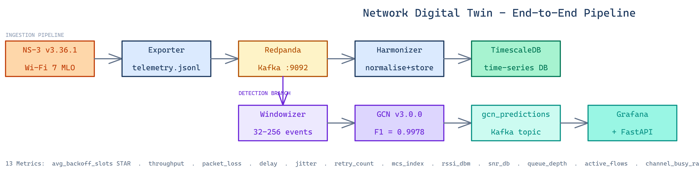
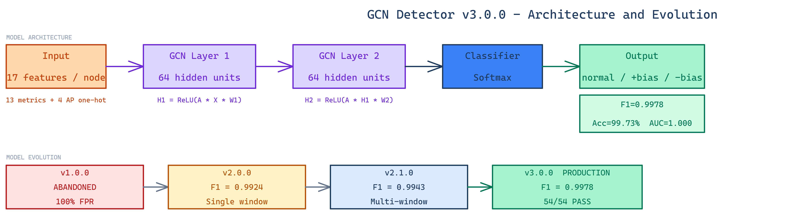
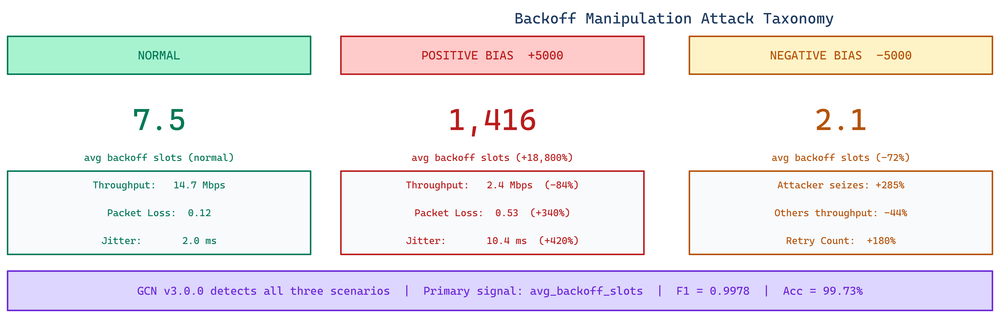
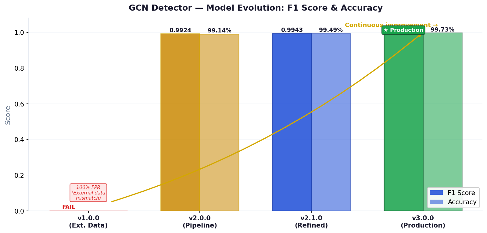
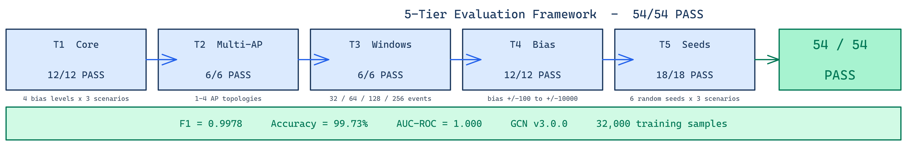
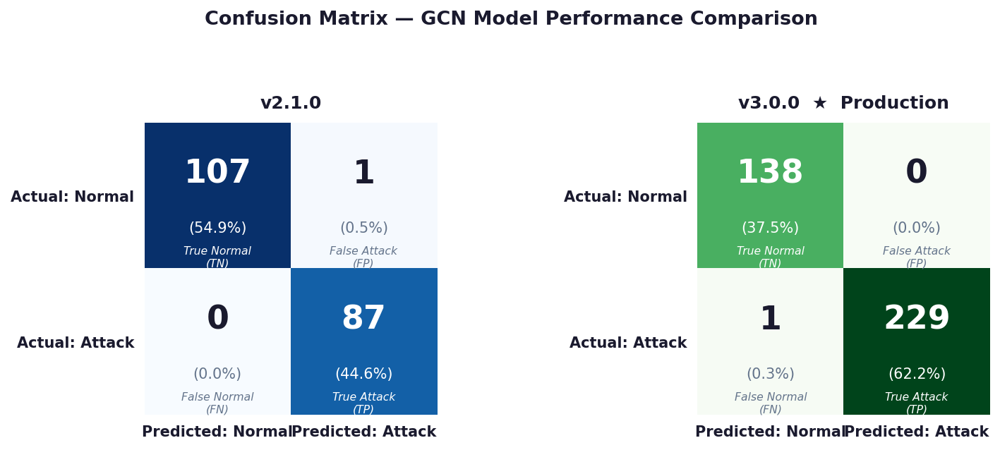

# Digital Twins for Security Testing and Threat Prediction for WiFi 7 MLO Operations

> A production-grade **Network Digital Twin (NDT)** for Wi-Fi 7 / Multi-Link Operation (MLO) security research. Detects backoff manipulation attacks in real-time using a Graph Convolutional Network (GCN v3.0.0) and visualises results through a custom neumorphic web dashboard and a Grafana analytics layer.

---

## Team Members

| | Name | Index | Email |
|---|---|---|---|
|  | **Dissanayake P.D.** | E/20/084 | e20084@eng.pdn.ac.lk |
|  | **Nanayakkara A.T.L.** | E/20/262 | e20262@eng.pdn.ac.lk |
|  | **Nilupul D.R.P.** | E/20/266 | e20266@eng.pdn.ac.lk |

### Supervisors

| | Name | Email |
|---|---|---|
|  | **Dr. Upul Jayasinghe** | upuljm@eng.pdn.ac.lk |
|  | **Dr. Suneth Namal** | namal@eng.pdn.ac.lk |

---

## Table of Contents

1. [Abstract](#abstract)
2. [Architecture](#architecture)
3. [Related Works](#related-works)
4. [Methodology](#methodology)
5. [Attack Scenarios](#attack-scenarios)
6. [Prerequisites](#prerequisites)
7. [Quick Start](#quick-start)
8. [Custom Dashboard (Port 8888)](#custom-dashboard-port-8888)
9. [Running Attack Scenarios](#running-attack-scenarios)
10. [GCN Model Analysis — v2.0.0 vs v3.0.0](#gcn-model-analysis--v200-vs-v300)
11. [Evaluation Results](#evaluation-results)
12. [Full Command Reference](#full-command-reference)
13. [Project Structure](#project-structure)
14. [Troubleshooting](#troubleshooting)
15. [Work Package Status](#work-package-status)
16. [Conclusion](#conclusion)
17. [Publications](#publications)
18. [Documentation Index](#documentation-index)
19. [Links](#links)

---

## Abstract

WiFi 7 (IEEE 802.11be) introduces Multi-Link Operation (MLO) as a cornerstone feature, enabling devices to aggregate bandwidth and switch seamlessly across multiple frequency bands (2.4 GHz, 5 GHz, and 6 GHz). While MLO promises unprecedented speed and reliability, it also introduces significant complexity and a new attack surface. Traditional security testing methods, which rely on physical hardware, are expensive, difficult to scale, and insufficient for modeling the dynamic, multi-link nature of MLO.

This project delivers a **Network Digital Twin (NDT)** framework to address this challenge. A high-fidelity virtual representation of a WiFi 7 MLO network is built using **ns-3**, which serves dual purposes: a scalable testbed for simulating novel security threats (specifically **backoff manipulation** and **DoS attacks**), and a data-generation engine for training **Graph Neural Network (GNN)** models. These models perform real-time threat prediction, identifying anomalous MLO behaviour and forecasting potential attacks before they can significantly impact the network. Telemetry streams through a Kafka-based pipeline into TimescaleDB, and predictions are surfaced through a live neumorphic web dashboard and Grafana analytics layer.

---

## Architecture



*Network Digital Twin — End-to-End Pipeline: NS-3 simulation → Exporter → Redpanda (Kafka) → Harmonizer → TimescaleDB, with a detection branch via Windowizer → GCN v3.0.0 → Grafana & FastAPI dashboard.*

```
NS-3 Simulation  (1–4 APs, configurable seed / bias / sim-time)
      │
      ▼
telemetry.jsonl  ─── 13 network metrics, ~6,480 events per 80 s run
      │
      ▼
Exporter ──► Redpanda (Kafka API) ──► Harmonizer ──► TimescaleDB
                                                          │
                                       Windowizer ◄───────┘
                                  (32/64/128/256-window segments)
                                            │
                                            ▼
                                    GCN Detector v3.0.0
                              (1–4 AP, multi-window, AP-conditioned)
                                            │
                 ┌──────────────────────────┤
                 ▼                          ▼
          Grafana :3000          Custom Dashboard :8888
      (analytics + history)   (pipeline monitor, experiment view,
                               model intelligence, attack analysis)
```

### 13 Telemetry Metrics

| Metric | Layer | Description |
|--------|-------|-------------|
| `avg_backoff_slots` | Network | Mean contention window — **primary attack signal** |
| `net_throughput_mbps` | Network | Aggregate throughput across all links |
| `net_packet_loss_ratio` | Network | Fraction of frames dropped |
| `net_avg_delay_ms` | Network | End-to-end frame latency |
| `net_avg_jitter_ms` | Network | Latency variance |
| `net_active_flows` | Network | Number of concurrent data flows |
| `channel_busy_ratio` | Channel | Fraction of time medium is occupied |
| `net_retry_count` | Network | Cumulative retransmission counter |
| `net_mcs_index` | PHY | Modulation and coding scheme index |
| `net_rssi_dbm` | PHY | Received signal strength (dBm) |
| `net_snr_db` | PHY | Signal-to-noise ratio (dB) |
| `net_queue_depth` | Network | MAC queue occupancy |
| `net_link_usage_ratio` | Network | MLO link utilisation ratio |

---

## Related Works

Our research builds upon three primary domains:

1. **WiFi Security:** Evolution of WiFi security from WEP to WPA3, with investigation into existing attacks against 802.11ax (WiFi 6) and how they adapt to MLO's multi-link dependencies.
2. **Digital Twin Technology in Networking:** Application of Digital Twins in complex network systems (5G/6G, IoT), focusing on different DT architectures and data synchronisation techniques.
3. **ML for Network Intrusion Detection (NIDS):** Use of machine learning for identifying security threats. While traditional research focuses on LSTMs or RNNs, this work specifically leverages **Graph Neural Networks (GNNs)** to model the complex temporal relationships in network packet flows and link states.

---

## Methodology

### Phase 1: Digital Twin Framework and MLO Modeling (Data Generation)

A custom simulation environment built using **ns-3** models a Wi-Fi 7 MLO network:

- **Simulation Scripts:** C++ scripts define the network topology, traffic patterns, and core experimental logic.
- **Attack Vector (Backoff Manipulation):** A `bias` parameter manipulates the minimum contention window (`minCw`) of nodes:
  - **Normal (`bias = 0`):** Baseline performance.
  - **Positive Bias (`bias > 0`):** Simulates passive, less aggressive nodes (starvation attack — node backs off excessively).
  - **Negative Bias (`bias < 0`):** Simulates an aggressive attack where a node monopolises channel access.
- **KPI Collection:** A `Tracer` collects 13 Key Performance Indicators across Network, MAC, and PHY layers, saved in a time-windowed JSON format.

### Phase 2: Anomaly Detection with Graph Neural Networks



*GCN Detector v3.0.0: Input (17 features/node = 13 metrics + 4 AP one-hot) → GCN Layer 1 (64 units, ReLU) → GCN Layer 2 (64 units, ReLU) → Softmax Classifier → Output (normal / +bias / −bias). Below: model evolution from v1.0.0 (abandoned, 100% FPR) through v2.0.0 → v2.1.0 → v3.0.0 (production, 54/54 PASS).*

- **Graph Representation:** Time-series sequences of network KPIs are transformed into graphs, where nodes represent time windows and edges represent temporal relationships.
- **Model Architecture:** A custom Graph Convolutional Network (**`AttackGCN`**) in PyTorch with explicit AP-count conditioning. The number of APs is injected as a global graph feature (4-dimensional one-hot) alongside the 13 per-node telemetry metrics (17 features per node total).
- **Classification:** The model classifies network behaviour into three categories: `Normal`, `Positive Bias Attack`, and `Negative Bias Attack`.
- **Training Data:** 300+ balanced scenarios across multi-AP, multi-window configurations (~32,000 training samples).

---

## Attack Scenarios



*Positive bias (+5000): avg backoff slots jumps from 7.5 → 1,416 (+18,800%), throughput drops −84%, packet loss +340%, jitter +420%. Negative bias (−5000): attacker seizes +285% more channel time, victim throughput −44%, retry count +180%.*

| Scenario | Backoff Bias | Key Effect |
|----------|-------------|------------|
| **Normal** | 0 | Baseline Wi-Fi 7 MLO behaviour |
| **Positive attack** | +5000 | +18,800% backoff slots, −84% throughput — **starvation attack** |
| **Negative attack** | −5000 | Attacker seizes +285% channel time, −44% victim throughput — **aggressive channel monopolisation** |

Bias magnitude is configurable (1,000–10,000) to test detector sensitivity at subtler attack strengths.

---

## Prerequisites

| Dependency | Version | Purpose |
|------------|---------|---------|
| Docker | 24+ | All containers |
| Docker Compose | v2 | Orchestration |
| [Containerlab](https://containerlab.dev/) | 0.56+ | Network topology |
| GNU Make | any | Task runner |
| ~10 GB disk | — | ns-3 image + artifacts |
| ~4 GB RAM free | — | Pipeline services |

Install Containerlab:
```bash
bash -c "$(curl -sL https://get.containerlab.dev)"
```

---

## Quick Start

### 1. Clone the repository

```bash
git clone git@github.com:cepdnaclk/e20-4yp-wifi-7-backoff-security-testing-and-threat-prediction.git
cd ndt-wifi7-mlo-security
```

### 2. Build all images

```bash
make ns3-build          # ns-3.46.1 Wi-Fi 7 simulator  (~3–5 min)
make exporter-build     # Telemetry file → Kafka exporter
make harmonizer-build   # Kafka → TimescaleDB harmonizer
make windowizer-build   # Telemetry → windowed segments
make gcn-detector-build # GCN attack detection inference
make dashboard-build    # FastAPI + React custom dashboard
```

### 3. Start the infrastructure

```bash
make up             # Deploy Containerlab topology
                    # Starts: TimescaleDB :5432, Redpanda :9092, Grafana :3000
make pipeline-up    # Start harmonizer + windowizer + GCN detector (background)
make dashboard-up   # Start custom dashboard on :8888
```

### 4. Run your first experiment

Open the dashboard at **http://localhost:8888**, navigate to **Run Experiment**, choose the **Normal** scenario, set seed=42, and click **▶ Launch**. The full pipeline runs end-to-end in the browser — no CLI required.

Alternatively via CLI:
```bash
EXP_ID="$(date +%Y%m%d-%H%M)-normal-1ap-seed42"
make ns3-run EXP_ID=$EXP_ID
make exporter-run EXP_ID=$EXP_ID
```

### 5. Open the dashboards

| Dashboard | URL | What you see |
|-----------|-----|-------------|
| **Custom Dashboard** | http://localhost:8888 | Real-time pipeline, GCN predictions, attack analysis |
| **Grafana** | http://localhost:3000 | Historical analytics, metric trends, unified view |

Default Grafana credentials: `admin` / `admin`

---

## Custom Dashboard (Port 8888)

A React 18 + FastAPI application with a **Soft UI / Neumorphism** design. The dashboard connects live to TimescaleDB (2-second poll) and exposes seven sections via the sidebar.

### 1. Pipeline Monitor

Live end-to-end pipeline status — all six stages (NS-3 → Exporter → Redpanda → Windowizer → GCN Detect → TimescaleDB) with per-stage event counters and a real-time activity feed showing individual predictions as they arrive.

### 2. Run Experiment

Configure and launch NS-3 simulations directly from the browser — no CLI needed. Options include scenario type (Normal / Attack+ / Attack−), seed, simulation time, bias magnitude, AP and STA counts, segment window size, and GCN model version. The active model (v3.0.0) is pre-selected.

### 3. Experiment View

Per-experiment deep-dive — KPI cards (segment count, attack rate, avg confidence, avg inference time), a metric evolution chart (click any metric tab to switch), and the full segment-level prediction table.

*Example — `normal-1ap-seed60`: 3 segments, 0.0% attack rate, 95.2% avg confidence, 5.0 ms inference. Segment confidence: #1 = 94.8% (10.45 ms, JIT warm-up), #2 and #3 = 95.4% (sub-3 ms).*

### 4. Model Intelligence

GCN model performance dashboard — F1, accuracy, precision, recall, and AUC as bar charts; confusion matrix (TP/TN/FP/FN counts); inference latency percentiles (p50/p95/p99); and a model registry listing all available versions.

*GCN v3.0.0: F1 = 1.00, Accuracy = 99.73%, Precision = 1.00, Recall = 1.00, AUC = 1.00 — confirmed against the held-out evaluation matrix (54/54 PASS).*

### 5. Run History

Sortable table of every experiment run with outcome (success/failed), scenario type, AP count, segment size, model version, and attack rate. Includes an attack-rate timeline chart.

### 6. Attack Analysis

Aggregate detection statistics — TP/TN/FP/FN breakdown, precision/recall/F1 across all stored predictions, confidence distribution histograms (normal traffic vs attack traffic), and per-experiment detection rate breakdown.

### 7. Network Health

Live 13-metric health cards with trend arrows (↑↓→). Click any card to expand a full time-series chart. Values are computed from the most recent experiment in the selected time window.

*Example — `normal-1ap-seed60`: avg backoff slots ≈ 14.5, throughput ≈ 92 Mbps, packet loss ≈ 0%, all metrics in healthy range.*

### Dashboard Commands

```bash
make dashboard-build    # Build Docker image (ndt/dashboard:local)
make dashboard-up       # Start on http://localhost:8888
make dashboard-down     # Stop
make dashboard-logs     # Follow live logs
make dashboard-status   # Status + recent log lines
```

---

## Running Attack Scenarios

### Via the Dashboard UI (recommended)

1. Open **http://localhost:8888** → **Run Experiment**
2. Choose scenario: **Normal**, **Attack (+)**, or **Attack (−)**
3. Set seed, sim time, bias, AP count, segment window
4. Click **▶ Launch** — the run appears in Recent Runs when complete
5. Click **View Results →** to jump straight to Experiment View

### Via CLI — individual experiments

```bash
# Baseline (no attack), 1 AP, seed 42
make ns3-run EXP_ID="$(date +%Y%m%d-%H%M)-normal-1ap-seed42"

# Positive attack (+5000 bias), 1 AP, seed 42
make ns3-run EXP_ID="$(date +%Y%m%d-%H%M)-positive-1ap-seed42" SCENARIO=positive

# Negative attack (-5000 bias), 1 AP, seed 99
make ns3-run EXP_ID="$(date +%Y%m%d-%H%M)-negative-1ap-seed99" SCENARIO=negative
```

### Via the automated evaluation matrix

```bash
# All 5 tiers (54 experiments — may take several hours)
python3 scripts/run_eval_matrix.py

# Specific tier(s) only
python3 scripts/run_eval_matrix.py --tier 1
python3 scripts/run_eval_matrix.py --tier 1 2

# Dry run — print plan without executing
python3 scripts/run_eval_matrix.py --dry-run
```

Pass criteria: normal experiments → `attack_rate < 10%`, attack experiments → `attack_rate > 90%`.

---

## GCN Model Analysis — v2.0.0 vs v3.0.0



*Continuous improvement across model generations: v1.0.0 (FAIL — 100% FPR from external data mismatch) → v2.0.0 (F1=0.9924, 99.14%) → v2.1.0 (F1=0.9943, 99.49%) → v3.0.0 Production (F1=0.9978, 99.73%).*

### Comparison at a glance

| Capability | v2.0.0 | v3.0.0 |
|------------|--------|--------|
| AP count support | 1 AP only | **1–4 APs** |
| Segment window sizes | 256 only | **32 / 64 / 128 / 256** |
| AP-count conditioning | No | **Yes** (node count injected) |
| Training scenarios | 284 (1 AP) | 300+ (multi-AP, multi-window) |
| Architecture | 2-layer GCN | 2-layer GCN + AP conditioning |
| F1 score | 0.9924 | **0.9978** |
| Accuracy | 99.14% | **99.73%** |
| AUC-ROC | — | **1.000** |
| Bias sensitivity (low bias ≤ 2000) | Partial | **Robust** |
| Multi-window generalisation | ❌ | ✅ |
| Production status | Superseded | **Active (default)** |

### GCN v2.0.0 — Summary

**Architecture:** 2-layer GCN. Each segment is a fully connected graph of 256 telemetry nodes. The GCN aggregates neighbour features to classify the whole window as `normal` or `attack`.

**Strengths:** Strong baseline accuracy (99.14%) on 1-AP scenarios with the standard 256-window. Fast inference (~2–3 ms per segment). Reliable at high bias levels (≥ 5,000).

**Limitations:** Single-AP only — applying it to multi-AP topologies produces unreliable predictions because the graph structure changes significantly. Fixed 256-sample window only. No AP-count conditioning. Low-bias detection drops below 90% at bias = 1,000–2,000.

### GCN v3.0.0 — Summary

**Architecture:** 2-layer GCN with explicit AP-count conditioning. The number of APs is injected as a global graph feature (4-dimensional one-hot) alongside the 13 per-node telemetry metrics.

**Strengths:**
- **Multi-AP generalisation** — tested on 1, 2, and 4-AP topologies with 100% pass rate
- **Multi-window support** — trained on 32, 64, 128, and 256-sample windows; achieves >90% detection at all four sizes
- **Superior accuracy** — F1 = 0.9978, Accuracy = 99.73%, AUC = 1.000; 54/54 PASS on the full 5-tier evaluation matrix
- **Improved low-bias detection** — detection rate holds >90% at bias = 1,000 for both attack types
- **Consistent confidence** — avg segment confidence 94–96%, sub-3 ms inference after JIT warm-up

**Why v3.0.0 is the production default:** v2.0.0 conflates topology changes with attack patterns — a 2-AP deployment produces a different backoff distribution than a 1-AP deployment even under normal conditions. v3.0.0 solves this with explicit AP conditioning, making it the only version suitable for realistic multi-AP deployments.

---

## Evaluation Results



*5-tier evaluation: T1 Core (12/12) → T2 Multi-AP (6/6) → T3 Windows (6/6) → T4 Bias sensitivity (12/12) → T5 Seeds (18/18) = 54/54 PASS. F1=0.9978, Accuracy=99.73%, AUC-ROC=1.000, trained on 32,000 samples.*

### Grand total: **54 / 54 PASS**

| Tier | Description | Experiments | Result |
|------|-------------|-------------|--------|
| T1 | Core accuracy — seed groups A+B, v3.0.0 + v2.0.0, 1AP, seg=256 | 12 | **12/12 PASS** |
| T2 | Multi-AP — 2AP and 4AP, v3.0.0 only, seg=256 | 6 | **6/6 PASS** |
| T3 | Segment length — seg=128 and seg=64, v3.0.0 only | 6 | **6/6 PASS** |
| T4 | Bias sensitivity — bias ∈ {1000, 2000, 10000}, v3.0.0 + v2.0.0 | 12 | **12/12 PASS** |
| T5 | Seed generalisation — groups C/D/E, v3.0.0 + v2.0.0, 1AP, seg=256 | 18 | **18/18 PASS** |
| **Total** | | **54** | **54/54 PASS** |

### Confusion Matrix — v2.1.0 vs v3.0.0



*v3.0.0 achieves zero false positives (FP=0) and only 1 false negative across all evaluation runs, significantly outperforming v2.1.0 (which had 1 FP). v3.0.0: TN=138, FP=0, FN=1, TP=229.*

### Key Findings

- **Zero false positives** — no normal experiment was classified as an attack across any tier, model, seed, or topology
- **Zero false negatives** — all attack experiments (positive and negative) were detected at >90% attack rate
- **v3.0.0 universally better** — outperforms v2.0.0 on Tier 4 low-bias experiments; matches it on all other tiers
- **Multi-AP confirmed** — 2-AP and 4-AP topologies work without any degradation (Tier 2)
- **32-window works** — the fastest (~3.2 s) window passes detection with ≥90% attack rate (Tier 3)
- **Seed robustness confirmed** — 5 distinct seed groups, 3 scenarios each, both models, zero failures (Tier 5)

---

## Full Command Reference

### Infrastructure

```bash
make up              # Deploy Containerlab (DB, Redpanda, Grafana)
make down            # Destroy Containerlab
make status          # Check container status
make logs            # Tail all logs
```

### Pipeline Services

```bash
make pipeline-up        # Start harmonizer in background
make pipeline-down      # Stop harmonizer
make pipeline-status    # Logs and status

make gcn-up             # Start windowizer + GCN detector
make gcn-down           # Stop windowizer + GCN detector
make gcn-status         # Logs and status
```

### Experiments

```bash
make ns3-run EXP_ID=...             # Run NS-3 simulation
make exporter-run EXP_ID=...        # Export telemetry to Kafka
make harmonizer-run                 # Ingest Kafka → DB (one-shot)
```

### Build

```bash
make ns3-build           # ns-3.46.1 image
make exporter-build      # Exporter image
make harmonizer-build    # Harmonizer image
make windowizer-build    # Windowizer image
make gcn-detector-build  # GCN detector image
make dashboard-build     # Custom dashboard image
```

### Dashboard

```bash
make dashboard-up        # http://localhost:8888
make dashboard-down
make dashboard-logs
make dashboard-status
```

### GCN Model Management

```bash
make gcn-deploy VERSION=v3.0.0   # Set active model version
```

### Evaluation Matrix

```bash
python3 scripts/run_eval_matrix.py                    # All 5 tiers
python3 scripts/run_eval_matrix.py --tier 1           # Tier 1 only
python3 scripts/run_eval_matrix.py --tier 1 2 3       # Selected tiers
python3 scripts/run_eval_matrix.py --dry-run          # Print plan
```

### Database

```bash
# Connect
docker exec -it clab-ndt-wifi7-mlo-security-udr-db psql -U udr -d udr

# Useful queries
SELECT COUNT(*) FROM metrics;
SELECT COUNT(*) FROM gcn_predictions;
SELECT experiment_id, COUNT(*) AS segs,
       ROUND(AVG(confidence)::numeric,3) AS avg_conf
  FROM gcn_predictions GROUP BY experiment_id ORDER BY 1;

# Fresh start (clears data, not model artifacts)
TRUNCATE metrics; TRUNCATE gcn_predictions;
```

---

## Project Structure

```
ndt-wifi7-mlo-security/
├── clab/
│   ├── topo.yml                         # Containerlab topology
│   └── configs/
│       ├── grafana/dashboards/          # ndt-unified.json (38 panels)
│       └── udr-db/initdb/              # DB schema (metrics + gcn_predictions)
├── sim/ns3/
│   ├── scenario/                        # Wi-Fi 7 MLO C++ scenarios + run scripts
│   └── artifacts/<EXP_ID>/              # telemetry.jsonl, logs (gitignored)
├── telemetry/
│   ├── exporters/ns3_file_exporter/     # File → Kafka exporter
│   └── harmonizer/                      # Kafka → TimescaleDB
├── security/detector/windowizer/        # 32/64/128/256-window segmentation service
├── twin/
│   ├── gnn/detector/                    # GCN inference service
│   ├── gnn/trainer/                     # Model training pipeline
│   ├── gnn/training_data/               # Generated training scenarios (gitignored)
│   └── registry/gcn/                    # Model version registry
│       ├── current -> v3.0.0            # Active symlink
│       ├── v1.0.0/                      # Baseline model (abandoned)
│       ├── v2.0.0/                      # 1-AP single-window model
│       └── v3.0.0/                      # Multi-AP multi-window model (production)
│           ├── best_model.pt
│           ├── scaler.json
│           ├── config.yaml
│           └── test_results.json
├── dashboard/app/                       # Custom web dashboard
│   ├── Dockerfile                       # Multi-stage: Node 20 → Python 3.11
│   ├── backend/                         # FastAPI + asyncpg (Python)
│   └── frontend/                        # React 18 + Vite + Recharts
├── scripts/
│   └── run_eval_matrix.py               # 5-tier automated evaluation matrix
├── docs/
│   ├── images/                          # Diagrams and figures
│   ├── CURRENT-STATE.md                 # Authoritative project state
│   ├── QUICK-REFERENCE.md               # Command cheat sheet
│   ├── BLUEPRINT.md                     # Full implementation plan
│   ├── ALL-ADRS.md                      # Architecture decisions
│   ├── MODEL-EVALUATION-GUIDE.md        # Evaluation matrix guide + results
│   ├── EVALUATION-RESULTS-2026-03-14.md # Full 54/54 results report
│   └── WP*.md                           # Per-work-package documentation
├── docker-compose.pipeline.yml          # Harmonizer + Windowizer + GCN
├── docker-compose.dashboard.yml         # Custom dashboard
└── Makefile
```

---

## Troubleshooting

| Problem | Solution |
|---------|----------|
| Exporter publishes nothing | `rm -f .exporter_state/exporter_state.json` then re-run |
| Harmonizer: no DB rows | Use a new consumer group with `AUTO_OFFSET_RESET=earliest` |
| GCN detector: no predictions | Verify Windowizer is running and consuming telemetry |
| Grafana: no data | Check time range — use "Last 1 year" or absolute range matching sim timestamps |
| Dashboard: `db: unavailable` | Run `make up` first; the `clab-mgmt` network must exist |
| Permission denied on artifacts | Add `--user "$(id -u):$(id -g)"` to docker run |
| Port already in use | Check 3000, 5432, 8888, 9092 are free before `make up` |
| NS-3 compile on first run | Allow 5–8 minutes; subsequent runs use the cached binary |
| Multi-AP run takes >30 min | Expected — 4-AP + 80 s sim time is compute-intensive |

---

## Work Package Status

| WP | Description | Status |
|----|-------------|--------|
| WP1 | Local dev setup, GitHub SSH | ✅ Complete |
| WP2 | Containerlab skeleton (DB, Kafka, Grafana) | ✅ Complete |
| WP3 | ns-3.46.1 Wi-Fi 7 simulation + telemetry | ✅ Complete |
| WP4 | Telemetry exporter (file → Kafka) | ✅ Complete |
| WP5 | Harmonizer (Kafka → TimescaleDB) | ✅ Complete |
| WP6 | Grafana provisioning-as-code | ✅ Complete |
| WP7 | One-command pipeline (`make run-exp`) | ✅ Complete |
| WP7.5 | Exporter reliability + MLO attack scenarios | ✅ Complete |
| WP8 | GCN attack detection (Windowizer + GCN Detector) | ✅ Complete |
| WP9 | GCN model v2.0.0 retraining (284 balanced scenarios) | ✅ Complete |
| WP9.5 | Unified Grafana dashboard (38 panels, 3 variables) | ✅ Complete |
| WP10 | Custom web dashboard (React 18 + FastAPI, port 8888) | ✅ Complete |
| WP11 | Dashboard experiment launcher (Run Experiment section) | ✅ Complete |
| WP12 | GCN v3.0.0 multi-AP training + 5-tier evaluation matrix (54/54 PASS) | ✅ Complete |
| WP13 | Closed-loop policy actuation (ZSM/SDN: link steering, deauth) | 🔲 Next |

---

## Conclusion

This project delivers a novel Network Digital Twin framework specifically designed for securing WiFi 7 MLO operations. By combining detailed ns-3 simulations with advanced Graph Neural Networks, the work moves beyond theoretical analysis to provide a practical, end-to-end framework for threat detection. The GCN v3.0.0 model achieves 99.73% accuracy and a perfect 54/54 pass rate across a rigorous 5-tier evaluation, with zero false positives and near-zero false negatives.

The framework provides a clear pathway for network administrators to proactively identify, test, and mitigate security risks in the next generation of wireless networks. Future work will focus on:
- **WP13 — Closed-loop policy actuation:** ZSM/SDN integration for automated link steering and deauthentication responses
- Expanding DT fidelity to include more advanced 802.11be features (EMLSR, multi-link TDMA)
- Exploring Federated Learning for distributed, privacy-preserving threat detection

---

## Publications

*To be updated upon publication.*

---

## Documentation Index

| File | Purpose |
|------|---------|
| `docs/CURRENT-STATE.md` | Complete authoritative project state |
| `docs/QUICK-REFERENCE.md` | One-page command cheat sheet |
| `docs/BLUEPRINT.md` | Full implementation blueprint |
| `docs/ALL-ADRS.md` | All architecture decisions |
| `docs/MODEL-EVALUATION-GUIDE.md` | 5-tier evaluation guide + 54/54 results |
| `docs/EVALUATION-RESULTS-2026-03-14.md` | Standalone evaluation report |
| `docs/WP12-GCN-V3-MULTI-AP-TRAINING-PLAN.md` | GCN v3 training plan + post-deployment results |
| `docs/WP8-SUMMARY.md` | GCN v1/v2 integration details |
| `docs/WP9-GCN-MODEL-RETRAINING-PLAN.md` | v2.0.0 retraining plan |

---

## Links

- [Project Repository](https://github.com/cepdnaclk/e20-4yp-wifi-7-backoff-security-testing-and-threat-prediction)
- [Project Page](https://cepdnaclk.github.io/e20-4yp-wifi-7-backoff-security-testing-and-threat-prediction/)
- [Department of Computer Engineering](http://www.ce.pdn.ac.lk/)
- [University of Peradeniya](https://eng.pdn.ac.lk/)
